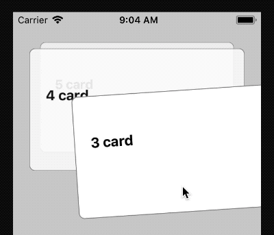

# Koloda-looping example

This example shows to loop card views using [Koloda](https://github.com/Yalantis/Koloda) with 'isLoop' feature.

* 'isLoop' feature was merged into origin master branch in version 4.4.
* The 'looping+deletion' branch is developing deletion with looping.

### Preview

